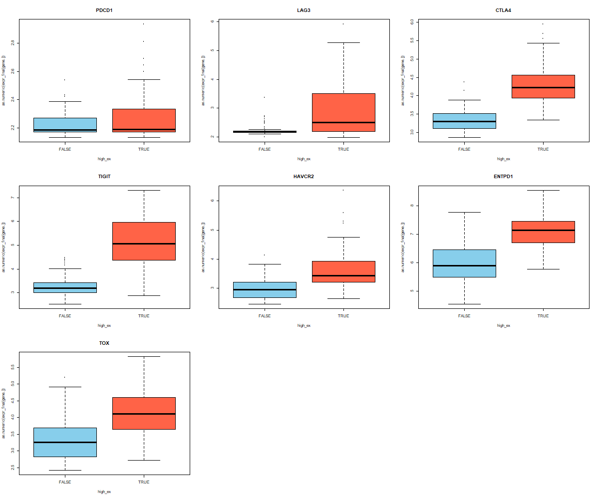
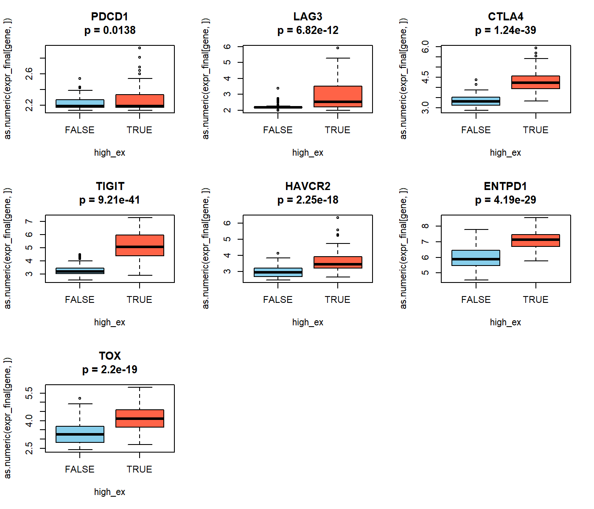
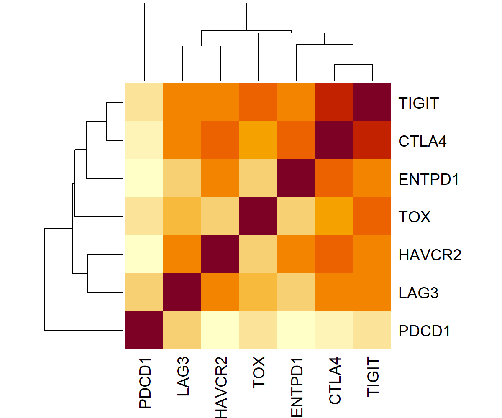
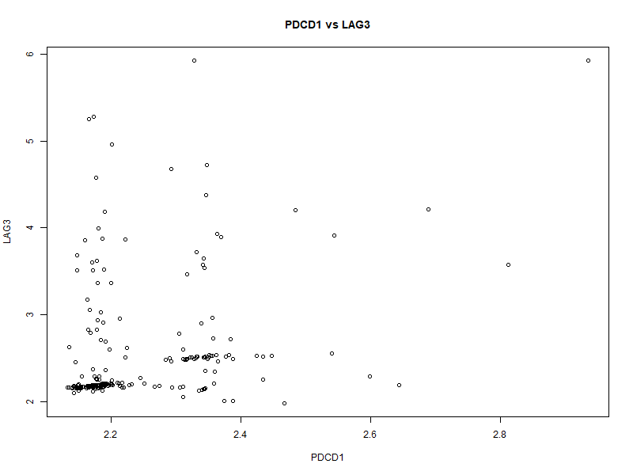
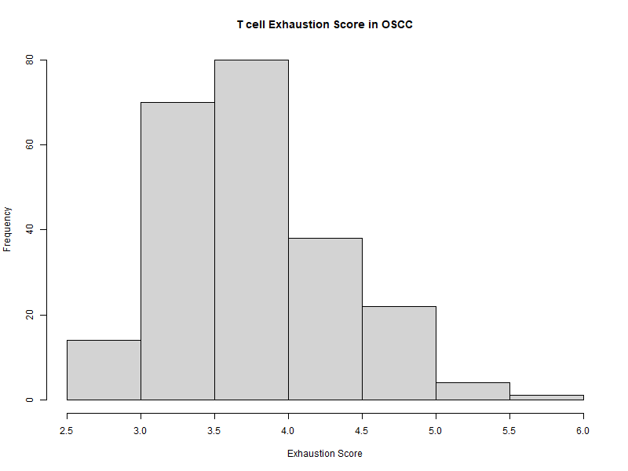
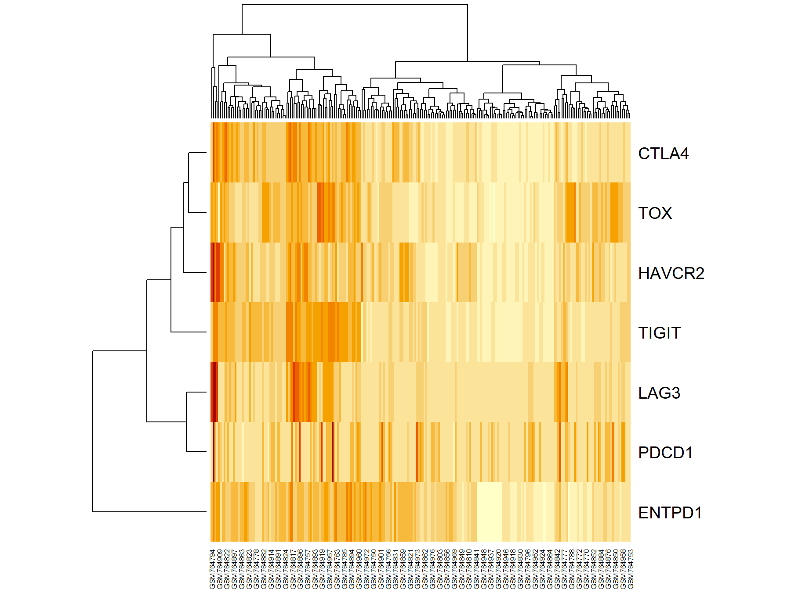

# T Cell Exhaustion Signature Analysis in Oral Squamous Cell Carcinoma


## Project Overview

This project explores T cell exhaustion-associated gene expression patterns in oral squamous cell carcinoma (OSCC) using public transcriptomic data from GEO.

The analysis focuses on understanding immune heterogeneity across OSCC tumors and evaluating the coordinated behavior of key immune checkpoint markers associated with dysfunctional T cell states.

## Why this project matters

T cell exhaustion is an important feature of dysfunctional anti-tumor immunity and may contribute to poor immune control in cancer. In oral squamous cell carcinoma (OSCC), understanding exhaustion-associated immune checkpoint programs can help explore tumor immune heterogeneity and potential mechanisms of immunotherapy resistance.

## Research Question

Do OSCC tumors show heterogeneous T cell exhaustion states, and which immune checkpoint genes are most strongly associated with exhaustion-high tumors?
---

## Dataset

* GEO Accession: GSE30784
* Platform: Affymetrix Human Genome U133 Plus 2.0 Array
* Samples: 229 OSCC tumor samples

**Data Source:** [GSE30784 GEO Dataset](https://www.ncbi.nlm.nih.gov/geo/query/acc.cgi?acc=GSE30784)
---

## Aim

To investigate whether OSCC tumors exhibit heterogeneous T cell exhaustion states and to study the relationship between major exhaustion-associated immune checkpoint markers including:

* PDCD1 (PD-1)
* LAG3
* CTLA4
* TIGIT
* HAVCR2 (TIM-3)
* ENTPD1 (CD39)
* TOX

---

## Methods

### Data Processing

* GEO data retrieval using GEOquery
* Probe-to-gene symbol annotation mapping
* Duplicate probe collapsing to gene-level expression matrix

### Exhaustion Analysis

* Exhaustion signature score generation
* High vs low exhaustion stratification
* Boxplot visualization of checkpoint markers
* Correlation analysis of exhaustion-associated genes
* Clustered heatmaps
* Principal Component Analysis (PCA)

---

## Key Findings

* OSCC tumors demonstrated heterogeneous exhaustion scores across patients.
* LAG3, TIGIT, CTLA4, ENTPD1, and TOX showed stronger association with the exhaustion-high phenotype.
* PDCD1 showed comparatively weaker coordination with the broader exhaustion marker network.
* Correlation analysis identified a coordinated checkpoint module involving TIGIT, CTLA4, LAG3, HAVCR2, ENTPD1, and TOX.
* PCA analysis revealed partial separation of exhaustion-high and exhaustion-low tumors, suggesting structured but heterogeneous immune states within the cohort.

---
## Main Interpretation

This exploratory analysis suggests that OSCC tumors do not show a uniform immune exhaustion pattern. Instead, tumors display variable exhaustion-associated transcriptional states.

Markers such as LAG3, TIGIT, CTLA4, HAVCR2, ENTPD1, and TOX appeared more coordinated with the exhaustion-high phenotype, while PDCD1 showed comparatively weaker coordination within the broader checkpoint marker network.

## Key Figures

### Exhaustion marker expression across high and low exhaustion groups



This figure compares exhaustion marker expression between low- and high-exhaustion OSCC tumors.

---

### Exhaustion marker expression with statistical significance



Statistical comparison of checkpoint marker expression between exhaustion groups.

---

### Correlation heatmap of exhaustion markers



Checkpoint correlation network showing coordinated immune exhaustion programs.

---

### PCA of exhaustion marker expression


PCA analysis demonstrating partial separation of exhaustion-high and exhaustion-low tumors.

---

### PDCD1 and LAG3 expression relationship



Relationship between PDCD1 and LAG3 expression across OSCC tumors.

---

### Exhaustion score distribution



Distribution of exhaustion scores across tumor samples.

---

### Exhaustion heatmap



Heatmap showing heterogeneity in exhaustion-associated checkpoint expression across OSCC tumors.


## Biological Interpretation

The results suggest that OSCC tumors contain diverse exhaustion-associated immune states rather than a single uniform suppressive phenotype.

In this cohort, coordinated LAG3/TIGIT/CTLA4-associated checkpoint programs appeared more strongly linked to the exhaustion phenotype than PDCD1-centered signaling alone.

---

## Tools and Packages

* R
* GEOquery
* dplyr
* ggplot2
* Base R plotting functions

---

## Project Structure

```text
OSCC_Project/
│
├── data/
├── scripts/
├── plots/
├── results/
└── README.md
```

---
## Limitations

This project is an exploratory analysis using bulk transcriptomic data. The results show gene expression associations and do not prove functional T cell exhaustion or causal immune mechanisms.

Further validation using single-cell RNA-seq, flow cytometry, spatial transcriptomics, or experimental assays would strengthen the biological interpretation.

## Future Directions

Future analysis will focus on cytotoxicity-associated immune programs in OSCC, including genes such as GZMB, PRF1, IFNG, GNLY, NKG7, and CD8A.

The next project will explore whether exhaustion-high tumors also retain cytotoxic immune activity or represent dysfunctional immune states.

## Skills Demonstrated

- GEO dataset analysis
- Probe-to-gene symbol mapping
- Gene-level expression matrix generation
- Exhaustion signature scoring
- High vs low exhaustion stratification
- Correlation analysis
- PCA visualization
- Heatmap generation
- Boxplot visualization with statistical comparison
- Biological interpretation of cancer transcriptomic data
- R programming for bioinformatics
## Author

## Author

Anjana Suresh

Master’s in Biotechnology
Cancer Immunology and Immunotherapeutics Research Background
ACTREC, Tata Memorial Centre


