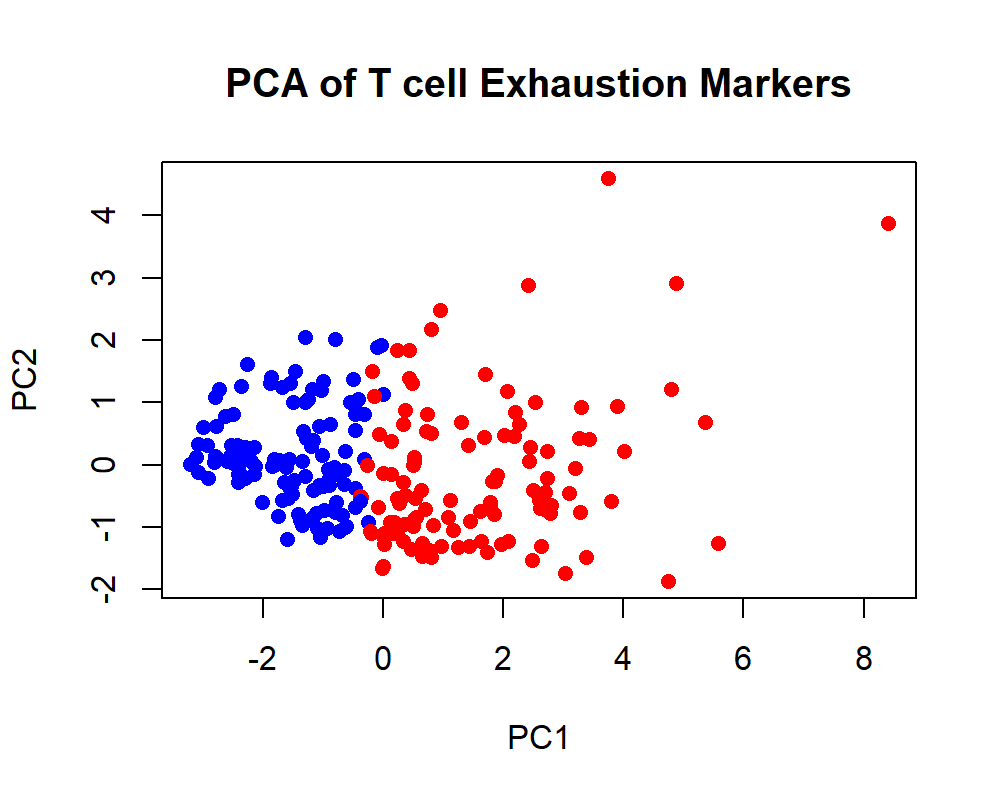

# T Cell Exhaustion Signature Analysis in Oral Squamous Cell Carcinoma

## Project Overview

This project explores T cell exhaustion-associated gene expression patterns in oral squamous cell carcinoma (OSCC) using public transcriptomic data from GEO.

The analysis focuses on understanding immune heterogeneity across OSCC tumors and evaluating the coordinated behavior of key immune checkpoint markers associated with dysfunctional T cell states.

---

## Dataset

* GEO Accession: GSE30784
* Platform: Affymetrix Human Genome U133 Plus 2.0 Array
* Samples: 229 OSCC tumor samples

Data Source:
https://www.ncbi.nlm.nih.gov/geo/query/acc.cgi?acc=GSE30784

---

## Aim

To investigate whether OSCC tumors exhibit heterogeneous T cell exhaustion states and to study the relationship between major exhaustion-associated immune checkpoint markers including:

* PDCD1 (PD-1)
* LAG3
* CTLA4
* TIGIT
* HAVCR2 (TIM-3)
* ENTPD1 (CD39)
* TOX

---

## Methods

### Data Processing

* GEO data retrieval using GEOquery
* Probe-to-gene symbol annotation mapping
* Duplicate probe collapsing to gene-level expression matrix

### Exhaustion Analysis

* Exhaustion signature score generation
* High vs low exhaustion stratification
* Boxplot visualization of checkpoint markers
* Correlation analysis of exhaustion-associated genes
* Clustered heatmaps
* Principal Component Analysis (PCA)

---

## Key Findings

* OSCC tumors demonstrated heterogeneous exhaustion scores across patients.
* LAG3, TIGIT, CTLA4, ENTPD1, and TOX showed stronger association with the exhaustion-high phenotype.
* PDCD1 showed comparatively weaker coordination with the broader exhaustion marker network.
* Correlation analysis identified a coordinated checkpoint module involving TIGIT, CTLA4, LAG3, HAVCR2, ENTPD1, and TOX.
* PCA analysis revealed partial separation of exhaustion-high and exhaustion-low tumors, suggesting structured but heterogeneous immune states within the cohort.

---
---

## Key Figures

### Exhaustion marker expression across high and low exhaustion groups


This figure compares exhaustion marker expression between low- and high-exhaustion OSCC tumors. TIGIT, CTLA4, LAG3, ENTPD1, HAVCR2, and TOX showed strong statistical differences between groups, while PDCD1 showed a weaker but significant difference.

---

### Correlation heatmap of exhaustion markers


This heatmap shows that TIGIT, CTLA4, LAG3, HAVCR2, ENTPD1, and TOX form a coordinated checkpoint network, while PDCD1 is comparatively less connected.

---

### PCA of exhaustion marker expression



PCA analysis demonstrated partial separation between high- and low-exhaustion tumors, suggesting structured immune heterogeneity across OSCC samples.

## Biological Interpretation

The results suggest that OSCC tumors contain diverse exhaustion-associated immune states rather than a single uniform suppressive phenotype.

In this cohort, coordinated LAG3/TIGIT/CTLA4-associated checkpoint programs appeared more strongly linked to the exhaustion phenotype than PDCD1-centered signaling alone.

---

## Tools and Packages

* R
* GEOquery
* dplyr
* ggplot2
* Base R plotting functions

---

## Project Structure

```text
OSCC_Project/
│
├── data/
├── scripts/
├── plots/
├── results/
└── README.md
```

---

## Author

Anjana Suresh

Master’s in Biotechnology
Cancer Immunology and Immunotherapeutics Research Background
ACTREC, Tata Memorial Centre


